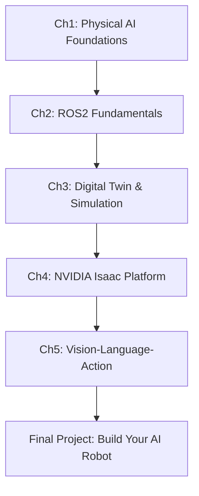

# Introduction to AI-Native Robotics

Welcome to **AI-Native Robotics** - your comprehensive guide to building intelligent robotic systems that seamlessly integrate artificial intelligence, perception, and physical action.

## 🎯 What You'll Learn

This textbook takes you on a journey from fundamental concepts to advanced implementations in robotics and AI. By the end, you'll be able to:

- **Design and build** intelligent robotic systems from scratch
- **Integrate AI models** with physical robots for real-world tasks
- **Simulate and test** robots in digital twin environments
- **Deploy vision-language-action (VLA)** models for embodied AI
- **Master industry-standard tools** like ROS2, Gazebo, and NVIDIA Isaac

## 🤖 Why AI-Native Robotics?

The robotics landscape is undergoing a fundamental transformation. Traditional robots followed pre-programmed rules and operated in controlled environments. **AI-Native Robots** are different:

- **Learn from experience** using machine learning and neural networks
- **Understand natural language** commands and context
- **Perceive their environment** using computer vision and sensor fusion
- **Adapt to changes** in real-time without reprogramming
- **Collaborate with humans** in unstructured environments

This shift represents the convergence of:
- 🧠 **Artificial Intelligence** (deep learning, foundation models)
- 👁️ **Computer Vision** (perception, scene understanding)
- 🦾 **Robotics** (manipulation, navigation, control)
- 🌐 **Simulation** (digital twins, synthetic data generation)

## 📚 Textbook Structure

This course is organized into five comprehensive chapters:

### Chapter 1: Introduction to Physical AI
Explore the foundations of embodied AI and understand how artificial intelligence transitions from digital algorithms to physical robots interacting with the real world.

**Topics:**
- The Physical AI revolution
- From digital to physical intelligence
- The humanoid robotics landscape
- Sensor systems and perception fundamentals

### Chapter 2: The Robotic Nervous System (ROS2)
Master ROS2 (Robot Operating System 2), the industry-standard middleware that serves as the nervous system connecting all components of modern robots.

**Topics:**
- ROS2 architecture and core concepts
- Nodes, topics, services, and actions
- Building modular robotic systems
- Real-time communication patterns
- Creating production-ready robot applications

### Chapter 3: Digital Twin (Gazebo & Unity)
Learn to create and leverage digital twins - virtual replicas of physical robots that enable safe testing, rapid iteration, and synthetic data generation.

**Topics:**
- Digital twin fundamentals and benefits
- Gazebo simulation environment
- URDF robot modeling and description
- Unity integration for photorealistic simulation
- Sim-to-real transfer techniques

### Chapter 4: The AI-Robot Brain (NVIDIA Isaac™)
Dive into NVIDIA's Isaac platform - a complete toolkit for building, training, and deploying AI-powered robots with GPU-accelerated perception and navigation.

**Topics:**
- Isaac Sim for robot simulation
- Isaac ROS for AI-accelerated perception
- Navigation and path planning
- Manipulation and grasping
- Synthetic data generation for training

### Chapter 5: Vision-Language-Action (VLA)
Explore the cutting edge of robotics AI - foundation models that understand vision, process natural language, and generate robotic actions.

**Topics:**
- Vision-language models for robotics
- Transformer architectures for embodied AI
- Action prediction and policy learning
- Multi-modal learning (vision + language + action)
- Deploying VLA models on physical robots

## 🛠️ Prerequisites

To get the most from this textbook, you should have:

### Essential
- **Python Programming**: Comfortable with Python 3.8+
- **Linux Basics**: Familiarity with Ubuntu/Linux command line
- **Basic Mathematics**: Linear algebra, calculus fundamentals

### Recommended
- **Machine Learning Basics**: Understanding of neural networks
- **Computer Vision**: Image processing fundamentals
- **Version Control**: Git and GitHub workflow

### Nice to Have
- **C++ Experience**: For performance-critical components
- **ROS1 Knowledge**: Helpful but not required
- **3D Graphics**: Understanding of coordinate systems and transformations

## 💻 Development Environment

You'll need the following tools and platforms:

### Required Software
- **Ubuntu 22.04 LTS** (or compatible Linux distribution)
- **ROS2 Humble** (Robot Operating System 2)
- **Python 3.10+** with pip and virtual environments
- **Docker** (for containerized workflows)

### Simulation Tools
- **Gazebo Garden** (physics simulation)
- **NVIDIA Isaac Sim** (GPU-accelerated simulation)
- **Unity** (optional, for photorealistic rendering)

### AI/ML Frameworks
- **PyTorch 2.0+** (deep learning framework)
- **NVIDIA Isaac ROS** (AI perception packages)
- **OpenCV** (computer vision library)
- **Transformers** (Hugging Face library for foundation models)

### Hardware Recommendations
- **GPU**: NVIDIA RTX 3060 or better (for Isaac Sim)
- **RAM**: 16GB minimum, 32GB recommended
- **Storage**: 100GB free space for simulation environments
- **CPU**: Multi-core processor (6+ cores recommended)

## 🚀 Getting Started

Ready to begin your journey? Here's how to get started:

### 1. Set Up Your Environment
Follow our detailed [Setup Guide](/docs/resources/setup-guide) to install all required software and configure your development environment.

### 2. Start with Chapter 1
Begin with [Chapter 1: Introduction to Physical AI](/docs/chapter1/physical-ai) to understand the fundamentals of AI-Native Robotics.

### 3. Follow Along with Examples
Every chapter includes hands-on code examples, tutorials, and exercises. Clone the companion repository:

```bash
git clone https://github.com/AsmaIqbal01/ai-native-book.git
cd ai-native-book
```

### 4. Join the Community
- **GitHub Discussions**: Ask questions and share projects
- **Issue Tracker**: Report bugs or suggest improvements
- **Lab Notes**: Read our blog for updates and advanced topics

## 🎓 Learning Path

We recommend following this structured learning path:



**Time Commitment**:
- **Full Course**: 12-16 weeks (10-15 hours/week)
- **Each Chapter**: 2-3 weeks
- **Hands-on Labs**: 4-6 hours per chapter

## 📖 How to Use This Textbook

### Reading the Content
- Each chapter builds on previous knowledge
- Code examples are fully documented and runnable
- Visual diagrams illustrate complex concepts
- Key concepts are highlighted in callout boxes

### Hands-On Practice
:::tip Practice Makes Perfect
The best way to learn robotics is by building. Each chapter includes:
- **Tutorials**: Step-by-step guided exercises
- **Lab Assignments**: Challenge problems to test your understanding
- **Projects**: End-to-end implementations of robotic systems
:::

### Additional Resources
- **Video Tutorials**: Supplementary video content for complex topics
- **Reference Sheets**: Quick-reference guides and cheatsheets
- **External Links**: Curated resources from the robotics community
- **Troubleshooting**: Common issues and solutions

## 🌟 What Makes This Different?

This textbook is **AI-Native** from the ground up:

1. **Modern Stack**: Uses the latest tools (ROS2, Isaac, VLA models)
2. **Hands-On First**: Learn by building real robotic systems
3. **Industry Relevant**: Skills directly applicable to robotics companies
4. **Foundation Models**: Covers cutting-edge AI approaches (transformers, VLAs)
5. **Simulation-First**: Extensive use of digital twins for safe learning
6. **Open Source**: All code and examples are freely available

## 🤝 Contributing

This is a living textbook that evolves with the field. Contributions are welcome:
- **Fix typos or errors**: Submit a pull request
- **Add examples**: Share your robot implementations
- **Suggest improvements**: Open an issue with ideas
- **Share feedback**: Let us know what works and what doesn't

## 📬 Get Help

Stuck on something? Here's where to get help:

1. **Check the [Troubleshooting Guide](/docs/resources/troubleshooting)**
2. **Search existing [GitHub Issues](https://github.com/AsmaIqbal01/ai-native-book/issues)**
3. **Ask in [Discussions](https://github.com/AsmaIqbal01/ai-native-book/discussions)**

## 🚦 Ready to Begin?

You're about to embark on an exciting journey into the world of AI-Native Robotics. Let's start building intelligent machines that can sense, think, and act in the real world.

<div style={{textAlign: 'center', margin: '40px 0'}}>
  <a href="/docs/chapter1/physical-ai" className="button button--primary button--lg">
    Start Chapter 1: Physical AI →
  </a>
</div>

---

**Author**: Asma Iqbal
**Last Updated**: December 2025
**License**: MIT

:::info Questions or Feedback?
Have questions about the course structure or content? Open a discussion on our [GitHub repository](https://github.com/AsmaIqbal01/ai-native-book/discussions).
:::