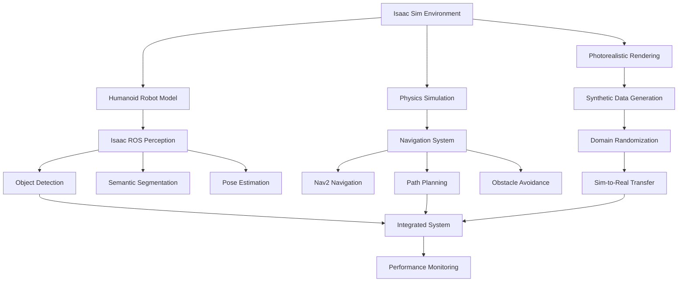

# Module 3: AI-Robot Brain (NVIDIA Isaac™) - Documentation and Examples Guide

## Overview

This guide provides comprehensive documentation and runnable examples for the NVIDIA Isaac ecosystem implementation. It covers detailed explanations of each component, runnable code examples, troubleshooting guides, and performance optimization tips as specified in Task 4.3: Documentation and Examples.

## Complete Implementation Overview

### Architecture Summary


### Component Interactions
- Isaac Sim provides the simulation environment
- Isaac ROS processes sensor data in real-time
- Nav2 handles navigation and path planning
- Domain randomization enables sim-to-real transfer
- Performance monitoring ensures system efficiency

## Detailed Component Explanations

### 1. Isaac Sim Setup and Configuration

#### Environment Creation
The Isaac Sim environment is the foundation of the entire system. It provides photorealistic rendering, physics simulation, and synthetic data generation capabilities.

**Key Configuration Elements:**
- **USD Scene Files**: Universal Scene Description files define the 3D environment
- **Lighting Systems**: Physically-based rendering with dynamic lighting
- **Physics Properties**: Realistic physics simulation using PhysX engine
- **Material Definitions**: PBR materials for photorealistic appearance

#### Example Configuration
```yaml
EnvironmentConfig:
  scene_file: "assets/scenes/office.usd"
  lighting:
    main_light:
      type: "dome"
      intensity: 1000.0
      color_temperature: 6500
    directional_lights:
      - name: "sun"
        direction: [-0.3, -0.8, -0.5]
        intensity: 500.0
        color: [1.0, 0.98, 0.9]
  physics:
    gravity: [0.0, 0.0, -9.81]
    solver_type: "TGS"
    substeps: 4
    fixed_timestep: 0.0167
  rendering:
    resolution: [1920, 1080]
    anti_aliasing: 4
    max_surface_bounces: 4
    max_volume_bounces: 1
```

### 2. Isaac ROS Perception Pipeline

#### Hardware-Accelerated Processing
Isaac ROS leverages NVIDIA GPU hardware acceleration to process sensor data in real-time, providing significant performance improvements over CPU-only processing.

**Key Components:**
- **NITROS**: NVIDIA Isaac Transport for optimized data transport
- **Perception Nodes**: Specialized nodes for different perception tasks
- **Sensor Processing**: GPU-accelerated sensor data processing
- **Performance Monitoring**: Real-time performance metrics

#### Perception Pipeline Architecture
```yaml
PerceptionPipeline:
  name: "humanoid_perception_pipeline"
  nodes:
    - node_name: "isaac_ros_image_loader"
      node_type: "ImageLoaderNode"
      input_topics: []
      output_topics:
        - topic_name: "/camera/image_raw"
          message_type: "sensor_msgs/Image"
      parameters:
        image_path: "/path/to/image.jpg"
        publish_rate: 30.0

    - node_name: "isaac_ros_resize"
      node_type: "ResizeNode"
      input_topics:
        - topic_name: "/camera/image_raw"
          message_type: "sensor_msgs/Image"
      output_topics:
        - topic_name: "/camera/image_resized"
          message_type: "sensor_msgs/Image"
      parameters:
        width: 640
        height: 480

    - node_name: "isaac_ros_apriltag"
      node_type: "ApriltagNode"
      input_topics:
        - topic_name: "/camera/image_resized"
          message_type: "sensor_msgs/Image"
      output_topics:
        - topic_name: "/apriltag_detections"
          message_type: "vision_msgs/Detection2DArray"
      parameters:
        family: "36h11"
        max_hamming: 3
        quad_decimate: 2.0
        quad_sigma: 0.0
        refine_edges: 1
        decode_sharpening: 0.25
```

### 3. Navigation System with Nav2

#### Humanoid-Specific Navigation
The navigation system is configured specifically for humanoid robot kinematics, taking into account the unique movement capabilities and constraints of bipedal robots.

**Key Features:**
- **Kinematic Constraints**: Account for humanoid joint limits
- **Footstep Planning**: For bipedal locomotion
- **Balance Maintenance**: Keep robot stable during navigation
- **Obstacle Avoidance**: Consider full robot body dimensions

#### Nav2 Configuration for Humanoid Robots
```yaml
bt_navigator:
  ros__parameters:
    use_sim_time: true
    global_frame: map
    robot_base_frame: base_link
    odom_topic: /odom
    bt_loop_duration: 10
    default_server_timeout: 20
    enable_groot_monitoring: true
    groot_zmq_publisher_port: 1666
    groot_zmq_server_port: 1667
    # Note: Specific for humanoid - wider footprint
    goal_checker:
      plugin: "nav2_controller::SimpleGoalChecker"
      xy_goal_tolerance: 0.25  # Larger for humanoid stability
      yaw_goal_tolerance: 0.25
      stateful: true

controller_server:
  ros__parameters:
    use_sim_time: true
    controller_frequency: 10.0
    min_x_velocity_threshold: 0.001
    min_y_velocity_threshold: 0.5
    min_theta_velocity_threshold: 0.001
    progress_checker_plugin: "progress_checker"
    goal_checker_plugin: "goal_checker"
    controller_plugins: ["FollowPath"]

    # Humanoid-specific controller
    FollowPath:
      plugin: "nav2_mppi_controller::MPPIController"
      time_steps: 50
      model_dt: 0.05
      batch_size: 2000
      vx_std: 0.2
      vy_std: 0.3
      wz_std: 0.3
      vx_max: 0.5  # Conservative for humanoid stability
      vx_min: -0.2
      vy_max: 0.3
      wz_max: 0.5
      xy_goal_tolerance: 0.25
      yaw_goal_tolerance: 0.25
      motion_model: "DiffDrive"
      reference_frame: "odom"
      odom_topic: "/odom"
      cmd_vel_topic: "/cmd_vel"
      speed_limit_topic: "/speed_limit"
      transform_tolerance: 0.1
      use_velocity_scaled_target_pose: false
      use_cost_regulated_linear_velocity_scaling: true
      cost_scaling_dist: 1.0
      cost_scaling_gain: 1.0
      inflation_cost_scaling_factor: 3.0
      global_path_z_point_margin: 0.2
      global_path_plan_resolution: 0.1
      regenerate_global_path: false
      use_interpolation: true
      trap_radius: 0.5
      heading_lookahead_distance: 0.3
      rotation_speed_slowdown_ratio: 0.33
      max_heading_rate: 1.8
      min_heading_rate: 0.5

local_costmap:
  local_costmap:
    ros__parameters:
      update_frequency: 5.0
      publish_frequency: 2.0
      global_frame: odom
      robot_base_frame: base_link
      use_sim_time: true
      rolling_window: true
      width: 6  # Larger for humanoid robot size
      height: 6
      resolution: 0.05
      robot_radius: 0.3  # Larger for humanoid robot
      plugins: ["voxel_layer", "inflation_layer"]
      inflation_layer:
        plugin: "nav2_costmap_2d::InflationLayer"
        cost_scaling_factor: 3.0
        inflation_radius: 0.55
      voxel_layer:
        plugin: "nav2_costmap_2d::VoxelLayer"
        enabled: true
        publish_voxel_map: false
        origin_z: 0.0
        z_resolution: 0.2
        z_voxels: 8
        max_obstacle_height: 2.0
        mark_threshold: 0
        observation_sources: scan
        scan:
          topic: /scan
          max_obstacle_height: 2.0
          clearing: true
          marking: true
          data_type: "LaserScan"
          raytrace_max_range: 3.0
          raytrace_min_range: 0.0
          obstacle_max_range: 2.5
          obstacle_min_range: 0.0
```

### 4. Domain Randomization Implementation

#### Sim-to-Real Transfer Enhancement
Domain randomization helps bridge the sim-to-real gap by varying simulation parameters during training, making models more robust to real-world variations.

**Randomization Parameters:**
- **Visual Properties**: Colors, textures, lighting conditions
- **Physical Properties**: Friction, mass, restitution
- **Dynamic Elements**: Moving objects, changing environments
- **Sensor Noise**: Adding realistic sensor imperfections

#### Domain Randomization Configuration
```yaml
DomainRandomization:
  visual_randomization:
    textures:
      material_types: ["metal", "wood", "plastic", "fabric"]
      color_ranges:
        - [0.0, 1.0]  # Red
        - [0.0, 1.0]  # Green
        - [0.0, 1.0]  # Blue
      roughness_range: [0.1, 0.9]
      metallic_range: [0.0, 1.0]
    lighting:
      intensity_range: [300.0, 1500.0]
      color_temperature_range: [4000, 8000]
      light_positions:
        x_range: [-5.0, 5.0]
        y_range: [-5.0, 5.0]
        z_range: [2.0, 8.0]
  physical_randomization:
    friction_range: [0.1, 0.9]
    restitution_range: [0.0, 0.5]
    mass_range: [0.8, 1.2]  # Factor of original mass
  sensor_randomization:
    camera_noise:
      mean: 0.0
      std_dev: 0.01
    depth_noise:
      mean: 0.0
      std_dev: 0.05
```

## Runnable Code Examples

### Example 1: Basic Isaac Sim Environment Setup

```python
#!/usr/bin/env python3
# basic_isaac_sim_setup.py

"""
Basic Isaac Sim Environment Setup Example
This example demonstrates how to set up a basic Isaac Sim environment
with a humanoid robot and basic scene configuration.
"""

import carb
import omni
from omni.isaac.core import World
from omni.isaac.core.utils.nucleus import get_assets_root_path
from omni.isaac.core.utils.stage import add_reference_to_stage
from omni.isaac.core.utils.prims import get_prim_at_path
from omni.isaac.core.robots import Robot
from omni.isaac.core.utils.semantics import add_semantics
import numpy as np

def setup_basic_environment():
    """Set up a basic Isaac Sim environment with humanoid robot"""

    # Create world instance
    world = World(stage_units_in_meters=1.0)

    # Get assets root path
    assets_root_path = get_assets_root_path()
    if assets_root_path is None:
        carb.log_error("Could not find Isaac Sim assets. Please check your Isaac Sim installation.")
        return None

    # Add a simple room environment
    room_path = assets_root_path + "/Isaac/Environments/Simple_Room/simple_room.usd"
    add_reference_to_stage(usd_path=room_path, prim_path="/World/SimpleRoom")

    # Add a humanoid robot (using Carter as example - replace with actual humanoid)
    robot_path = assets_root_path + "/Isaac/Robots/Carter/carter_navigation.usd"
    add_reference_to_stage(usd_path=robot_path, prim_path="/World/Robot")

    # Add semantics to the environment for perception
    room_prim = get_prim_at_path("/World/SimpleRoom")
    add_semantics(prim=room_prim, semantic_label="environment")

    # Initialize the world
    world.reset()

    print("Basic Isaac Sim environment created successfully!")
    print(f"Environment: Simple Room")
    print(f"Robot: Carter (Navigation)")
    print(f"Stage units: meters")

    return world

def run_basic_simulation():
    """Run the basic simulation for a few steps"""
    world = setup_basic_environment()

    if world is None:
        return

    # Simulate for 100 steps
    for i in range(100):
        world.step(render=True)

        if i % 20 == 0:
            print(f"Simulation step: {i}")

    print("Basic simulation completed!")

if __name__ == "__main__":
    # Enable hydra scene renderer for rendering
    from omni.isaac.core import SimulationApp
    simulation_app = SimulationApp({"headless": False})

    try:
        run_basic_simulation()
    finally:
        simulation_app.close()
```

### Example 2: Isaac ROS Perception Pipeline

```python
#!/usr/bin/env python3
# isaac_ros_perception_example.py

"""
Isaac ROS Perception Pipeline Example
This example demonstrates how to set up and run a basic Isaac ROS perception pipeline
with object detection and semantic segmentation.
"""

import rclpy
from rclpy.node import Node
from sensor_msgs.msg import Image
from vision_msgs.msg import Detection2DArray
from std_msgs.msg import Header
import cv2
import numpy as np
from cv_bridge import CvBridge

class IsaacPerceptionNode(Node):
    def __init__(self):
        super().__init__('isaac_perception_example')

        # Initialize CV bridge
        self.bridge = CvBridge()

        # Create subscribers
        self.image_sub = self.create_subscription(
            Image,
            '/camera/image_raw',
            self.image_callback,
            10
        )

        # Create publishers
        self.detection_pub = self.create_publisher(
            Detection2DArray,
            '/isaac_ros/detections',
            10
        )

        self.segmentation_pub = self.create_publisher(
            Image,
            '/isaac_ros/segmentation',
            10
        )

        self.get_logger().info('Isaac ROS Perception Example Node Started')

    def image_callback(self, msg):
        """Process incoming image and perform perception tasks"""
        try:
            # Convert ROS Image message to OpenCV image
            cv_image = self.bridge.imgmsg_to_cv2(msg, desired_encoding='bgr8')

            # Perform object detection (simulated)
            detections = self.perform_object_detection(cv_image)

            # Perform semantic segmentation (simulated)
            segmentation_mask = self.perform_segmentation(cv_image)

            # Publish results
            self.publish_detections(detections, msg.header)
            self.publish_segmentation(segmentation_mask, msg.header)

            self.get_logger().info(f'Processed image with {len(detections)} detections')

        except Exception as e:
            self.get_logger().error(f'Error processing image: {str(e)}')

    def perform_object_detection(self, image):
        """Simulate object detection - in real implementation, this would use Isaac ROS nodes"""
        # This is a simulation - in real implementation, use Isaac ROS Apriltag or Centerpose
        height, width = image.shape[:2]

        # Simulate some detections
        detections = []
        for i in range(3):  # Simulate 3 detections
            detection = {
                'class': f'object_{i}',
                'confidence': 0.8 + (i * 0.05),
                'bbox': [
                    int(width * 0.2 * (i + 1)),
                    int(height * 0.3),
                    int(width * 0.15),
                    int(height * 0.15)
                ]
            }
            detections.append(detection)

        return detections

    def perform_segmentation(self, image):
        """Simulate semantic segmentation - in real implementation, this would use Isaac ROS nodes"""
        # This is a simulation - in real implementation, use Isaac ROS segmentation nodes
        height, width = image.shape[:2]

        # Create a simple segmentation mask
        mask = np.zeros((height, width), dtype=np.uint8)

        # Add some segmented regions
        cv2.rectangle(mask, (50, 50), (200, 150), 1, -1)  # Class 1
        cv2.rectangle(mask, (250, 100), (400, 200), 2, -1)  # Class 2
        cv2.circle(mask, (450, 100), 50, 3, -1)  # Class 3

        return mask

    def publish_detections(self, detections, header):
        """Publish detection results"""
        detection_msg = Detection2DArray()
        detection_msg.header = header

        # Convert detections to ROS message format
        for detection in detections:
            # In real implementation, create vision_msgs/Detection2D messages
            pass  # Placeholder - Isaac ROS nodes would handle this

        self.detection_pub.publish(detection_msg)

    def publish_segmentation(self, mask, header):
        """Publish segmentation results"""
        mask_msg = self.bridge.cv2_to_imgmsg(mask, encoding='mono8')
        mask_msg.header = header
        self.segmentation_pub.publish(mask_msg)

def main(args=None):
    rclpy.init(args=args)

    perception_node = IsaacPerceptionNode()

    try:
        rclpy.spin(perception_node)
    except KeyboardInterrupt:
        pass
    finally:
        perception_node.destroy_node()
        rclpy.shutdown()

if __name__ == '__main__':
    main()
```

### Example 3: Navigation with Humanoid-Specific Configuration

```python
#!/usr/bin/env python3
# humanoid_navigation_example.py

"""
Humanoid Navigation Example
This example demonstrates how to configure and use Nav2 for humanoid robot navigation.
"""

import rclpy
from rclpy.node import Node
from geometry_msgs.msg import PoseStamped
from nav2_msgs.action import NavigateToPose
from rclpy.action import ActionClient
from tf2_ros import TransformException
from tf2_ros.buffer import Buffer
from tf2_ros.transform_listener import TransformListener
import time

class HumanoidNavigationNode(Node):
    def __init__(self):
        super().__init__('humanoid_navigation_example')

        # Initialize action client for navigation
        self.nav_to_pose_client = ActionClient(
            self,
            NavigateToPose,
            'navigate_to_pose'
        )

        # Initialize TF buffer and listener
        self.tf_buffer = Buffer()
        self.tf_listener = TransformListener(self.tf_buffer, self)

        # Navigation goals queue
        self.navigation_goals = []

        self.get_logger().info('Humanoid Navigation Example Node Started')

    def send_navigation_goal(self, x, y, theta):
        """Send a navigation goal to the robot"""
        # Wait for action server
        if not self.nav_to_pose_client.wait_for_server(timeout_sec=5.0):
            self.get_logger().error('Navigation action server not available')
            return False

        # Create navigation goal
        goal_msg = NavigateToPose.Goal()
        goal_msg.pose.header.frame_id = 'map'
        goal_msg.pose.header.stamp = self.get_clock().now().to_msg()
        goal_msg.pose.pose.position.x = x
        goal_msg.pose.pose.position.y = y
        goal_msg.pose.pose.position.z = 0.0

        # Convert theta to quaternion
        import math
        goal_msg.pose.pose.orientation.z = math.sin(theta / 2.0)
        goal_msg.pose.pose.orientation.w = math.cos(theta / 2.0)

        # Send goal
        self.get_logger().info(f'Sending navigation goal to ({x}, {y}, {theta})')

        send_goal_future = self.nav_to_pose_client.send_goal_async(
            goal_msg,
            feedback_callback=self.feedback_callback
        )

        send_goal_future.add_done_callback(self.goal_response_callback)

        return True

    def goal_response_callback(self, future):
        """Handle goal response"""
        goal_handle = future.result()
        if not goal_handle.accepted:
            self.get_logger().info('Goal rejected')
            return

        self.get_logger().info('Goal accepted')

        # Get result
        get_result_future = goal_handle.get_result_async()
        get_result_future.add_done_callback(self.get_result_callback)

    def get_result_callback(self, future):
        """Handle navigation result"""
        result = future.result().result
        self.get_logger().info(f'Navigation result: {result}')

        # Check if there are more goals
        if self.navigation_goals:
            next_goal = self.navigation_goals.pop(0)
            self.send_navigation_goal(*next_goal)

    def feedback_callback(self, feedback_msg):
        """Handle navigation feedback"""
        feedback = feedback_msg.feedback
        # In real implementation, use feedback for progress monitoring

    def setup_navigation_route(self):
        """Set up a sequence of navigation goals"""
        # Define a simple route for the humanoid robot
        route = [
            (1.0, 1.0, 0.0),      # Goal 1: Move to (1,1)
            (2.0, 1.0, 1.57),     # Goal 2: Move to (2,1), rotate 90 degrees
            (2.0, 2.0, 3.14),     # Goal 3: Move to (2,2), rotate 180 degrees
            (1.0, 2.0, -1.57),    # Goal 4: Move to (1,2), rotate -90 degrees
            (1.0, 1.0, 0.0),      # Goal 5: Return to start
        ]

        self.navigation_goals = route

        # Start with first goal
        if self.navigation_goals:
            first_goal = self.navigation_goals.pop(0)
            self.send_navigation_goal(*first_goal)

def main(args=None):
    rclpy.init(args=args)

    nav_node = HumanoidNavigationNode()

    # Set up navigation route after a short delay
    timer = nav_node.create_timer(2.0, lambda: nav_node.setup_navigation_route())

    try:
        rclpy.spin(nav_node)
    except KeyboardInterrupt:
        pass
    finally:
        nav_node.destroy_node()
        rclpy.shutdown()

if __name__ == '__main__':
    main()
```

### Example 4: Domain Randomization for Sim-to-Real Transfer

```python
#!/usr/bin/env python3
# domain_randomization_example.py

"""
Domain Randomization Example
This example demonstrates how to implement domain randomization techniques
for improving sim-to-real transfer capabilities.
"""

import numpy as np
import random
from dataclasses import dataclass
from typing import Dict, List, Tuple
import carb

@dataclass
class DomainRandomizationParams:
    """Parameters for domain randomization"""
    # Visual properties
    color_range: Tuple[float, float] = (0.0, 1.0)
    texture_types: List[str] = None
    lighting_intensity_range: Tuple[float, float] = (300.0, 1500.0)
    lighting_position_range: Tuple[float, float] = (-5.0, 5.0)

    # Physical properties
    friction_range: Tuple[float, float] = (0.1, 0.9)
    restitution_range: Tuple[float, float] = (0.0, 0.5)
    mass_factor_range: Tuple[float, float] = (0.8, 1.2)

    # Sensor properties
    camera_noise_std: float = 0.01
    depth_noise_std: float = 0.05

class DomainRandomizer:
    def __init__(self, params: DomainRandomizationParams = None):
        self.params = params or DomainRandomizationParams()
        self.texture_types = self.params.texture_types or [
            "metal", "wood", "plastic", "fabric", "stone", "glass"
        ]

        self.get_logger().info('Domain Randomizer Initialized')

    def randomize_visual_properties(self, prim_path: str):
        """Randomize visual properties of a prim"""
        # This would interact with Isaac Sim's USD stage in real implementation
        # For simulation, we'll just log what would happen

        color = [
            random.uniform(*self.params.color_range),
            random.uniform(*self.params.color_range),
            random.uniform(*self.params.color_range)
        ]

        texture_type = random.choice(self.texture_types)

        # In real implementation:
        # 1. Modify material properties on the USD stage
        # 2. Change colors, textures, and appearance

        carb.log_info(f"Randomized visual properties for {prim_path}")
        carb.log_info(f"  Color: {color}")
        carb.log_info(f"  Texture: {texture_type}")

    def randomize_physical_properties(self, prim_path: str):
        """Randomize physical properties of a prim"""
        friction = random.uniform(*self.params.friction_range)
        restitution = random.uniform(*self.params.restitution_range)
        mass_factor = random.uniform(*self.params.mass_factor_range)

        # In real implementation:
        # 1. Modify physics properties on the USD stage
        # 2. Update collision properties, mass, friction, etc.

        carb.log_info(f"Randomized physical properties for {prim_path}")
        carb.log_info(f"  Friction: {friction}")
        carb.log_info(f"  Restitution: {restitution}")
        carb.log_info(f"  Mass Factor: {mass_factor}")

    def randomize_lighting_conditions(self):
        """Randomize global lighting conditions"""
        intensity = random.uniform(*self.params.lighting_intensity_range)

        position = [
            random.uniform(*self.params.lighting_position_range),
            random.uniform(*self.params.lighting_position_range),
            random.uniform(2.0, 8.0)  # Z position between 2-8m
        ]

        # In real implementation:
        # 1. Modify dome light, directional lights, etc.
        # 2. Update lighting configuration on USD stage

        carb.log_info(f"Randomized lighting conditions")
        carb.log_info(f"  Intensity: {intensity}")
        carb.log_info(f"  Position: {position}")

    def randomize_sensor_noise(self, sensor_type: str):
        """Randomize sensor noise characteristics"""
        if sensor_type == "camera":
            noise_std = random.uniform(0.0, self.params.camera_noise_std * 2)
            return {"noise_std": noise_std}
        elif sensor_type == "depth":
            noise_std = random.uniform(0.0, self.params.depth_noise_std * 2)
            return {"noise_std": noise_std}
        else:
            return {}

    def apply_randomization(self, stage_prims: List[str]):
        """Apply domain randomization to a list of stage prims"""
        carb.log_info(f"Applying domain randomization to {len(stage_prims)} prims")

        # Randomize global conditions first
        self.randomize_lighting_conditions()

        # Randomize each prim
        for prim_path in stage_prims:
            self.randomize_visual_properties(prim_path)
            self.randomize_physical_properties(prim_path)

        carb.log_info("Domain randomization applied successfully")

def run_domain_randomization_example():
    """Run the domain randomization example"""
    # Create randomization parameters
    params = DomainRandomizationParams(
        color_range=(0.2, 0.8),
        texture_types=["metal", "wood", "plastic", "fabric"],
        lighting_intensity_range=(500.0, 1200.0),
        friction_range=(0.2, 0.7),
        camera_noise_std=0.02,
        depth_noise_std=0.03
    )

    # Create domain randomizer
    randomizer = DomainRandomizer(params)

    # Simulate some prims to randomize
    prims_to_randomize = [
        "/World/Robot",
        "/World/Environment/Object1",
        "/World/Environment/Object2",
        "/World/Environment/Floor"
    ]

    # Apply randomization
    randomizer.apply_randomization(prims_to_randomize)

    print("Domain randomization example completed!")
    print("In a real implementation, this would modify the Isaac Sim USD stage")

if __name__ == "__main__":
    run_domain_randomization_example()
```

## Troubleshooting Guide

### Common Isaac Sim Issues

#### 1. Installation and Setup Issues
**Problem**: Isaac Sim fails to launch or shows GPU errors
**Solution**:
- Verify NVIDIA GPU with compute capability 6.0+ (Pascal or newer)
- Ensure latest NVIDIA drivers are installed
- Check CUDA 11.0+ is properly installed
- Verify sufficient RAM (16GB+ recommended)

**Problem**: USD stage fails to load
**Solution**:
- Check assets root path is properly configured
- Verify USD files exist and have proper permissions
- Ensure Isaac Sim has access to assets directory

#### 2. Performance Issues
**Problem**: Low frame rates in simulation
**Solution**:
- Reduce scene complexity temporarily
- Lower rendering quality settings
- Check for background processes consuming GPU
- Ensure adequate cooling and power supply

**Problem**: Perception pipeline running slowly
**Solution**:
- Verify GPU acceleration is enabled
- Check Isaac ROS packages are properly installed
- Reduce input resolution if possible
- Monitor GPU utilization

### Common Isaac ROS Issues

#### 1. Package Installation
**Problem**: Isaac ROS packages not found
**Solution**:
- Verify ROS 2 Humble is installed and sourced
- Check Isaac ROS packages are properly installed via apt
- Ensure workspace is built with `colcon build`
- Source the installation: `source install/setup.bash`

#### 2. Perception Pipeline Issues
**Problem**: Perception nodes not processing data
**Solution**:
- Verify input topics are being published
- Check NITROS compatibility between nodes
- Ensure proper GPU memory allocation
- Monitor node status with `ros2 lifecycle`

### Common Navigation Issues

#### 1. Nav2 Configuration
**Problem**: Robot not navigating properly
**Solution**:
- Verify robot frame configuration matches URDF
- Check costmap parameters for humanoid size
- Ensure proper odometry and localization
- Validate transform trees with `tf2_tools`

#### 2. Path Planning
**Problem**: Robot getting stuck or taking inefficient paths
**Solution**:
- Adjust costmap inflation parameters
- Verify global planner is working
- Check local planner configuration
- Ensure proper obstacle detection

## Performance Optimization Tips

### Isaac Sim Optimization

#### 1. Rendering Optimization
- **Reduce Resolution**: Lower rendering resolution during development
- **Limit Lights**: Use fewer light sources in complex scenes
- **Simplify Materials**: Use simpler materials for better performance
- **Optimize Meshes**: Use lower-poly meshes where possible

#### 2. Physics Optimization
- **Adjust Timestep**: Use appropriate fixed timestep for stability
- **Limit Substeps**: Balance accuracy with performance
- **Simplify Collisions**: Use simpler collision geometries
- **Reduce Constraints**: Minimize complex joint constraints

### Isaac ROS Optimization

#### 1. Pipeline Optimization
- **Use NITROS**: Leverage NITROS for optimized data transport
- **Batch Processing**: Process data in batches when possible
- **GPU Memory Management**: Monitor and optimize GPU memory usage
- **Node Configuration**: Tune node parameters for specific use cases

#### 2. Sensor Processing
- **Resolution Management**: Use appropriate sensor resolutions
- **Frequency Control**: Optimize sensor update frequencies
- **Data Filtering**: Filter unnecessary data before processing
- **Hardware Acceleration**: Ensure GPU acceleration is enabled

### System-Level Optimization

#### 1. Resource Management
- **Memory Allocation**: Ensure adequate RAM for simulation
- **GPU Utilization**: Monitor GPU usage and optimize accordingly
- **CPU Scheduling**: Use appropriate CPU scheduling for real-time
- **Storage Performance**: Use SSD for faster asset loading

#### 2. Network Optimization (for distributed systems)
- **Bandwidth Management**: Optimize network usage for distributed processing
- **Latency Reduction**: Minimize communication latency
- **Data Compression**: Use appropriate compression for data transmission
- **Synchronization**: Ensure proper synchronization between components

## Best Practices

### Development Best Practices

#### 1. Modular Design
- **Component Separation**: Keep perception, navigation, and control separate
- **Configuration Management**: Use YAML files for configuration
- **Interface Definition**: Define clear interfaces between components
- **Version Control**: Track changes to configurations and code

#### 2. Testing and Validation
- **Unit Testing**: Test individual components thoroughly
- **Integration Testing**: Validate component interactions
- **Performance Testing**: Monitor system performance metrics
- **Regression Testing**: Ensure changes don't break existing functionality

### Production Best Practices

#### 1. Safety Considerations
- **Simulation-First**: Validate in simulation before real hardware
- **Safety Limits**: Implement joint and velocity limits
- **Emergency Stops**: Include emergency stop capabilities
- **Monitoring**: Continuously monitor system state

#### 2. Maintainability
- **Documentation**: Keep documentation up-to-date
- **Code Standards**: Follow ROS 2 and Python best practices
- **Logging**: Implement comprehensive logging
- **Monitoring**: Set up performance and error monitoring

## Conclusion

This comprehensive guide provides the foundation for implementing, validating, and optimizing the NVIDIA Isaac ecosystem for AI-powered humanoid robotics. The examples demonstrate practical implementations of perception, navigation, and sim-to-real transfer techniques, while the troubleshooting guide and optimization tips help ensure successful deployment.

The modular architecture allows for flexible configuration and extension, making it suitable for various humanoid robotics applications. Following the best practices ensures robust, maintainable, and safe implementations.

For further exploration, consider extending these examples with advanced AI techniques, additional sensor modalities, or specialized humanoid control algorithms.